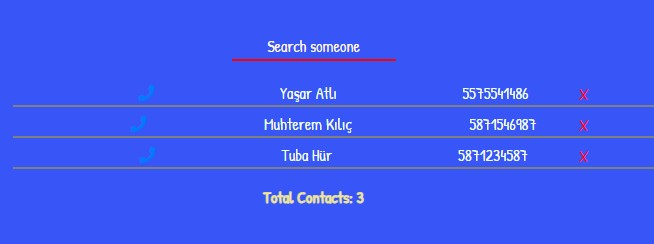
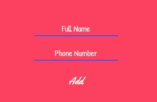
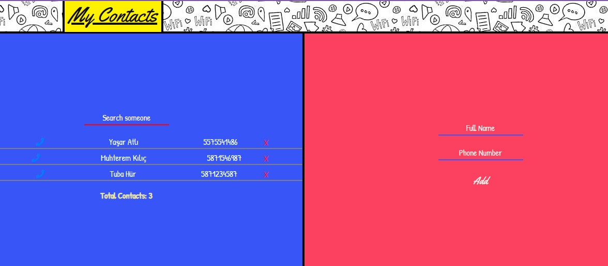

# My Contacts App With React

## VİEWS

  

## WHAT PRESENTS TO YOU?

- This is a basic contact app.
- You can add your contacts to app.
- You can call someone simply by pressing the call button.
- You can delete someone on list by using the close button.

## WHICH LANGUAGES DOES APP USE?

- Uses ReactJS and Redux.
- Uses CSS Animations.

- The app could develop.
 - **This app is currently under development for UI and page design.**

## WHICH LIBRARY AND PACKAGES WAS USED IN THIS APP? 

- This project was developed using by ReactJS and ReduxJS for state management.
- The one of the packages which was used in this app is **"Lodash"**.
- By importing **"throttle"** under the **lodash/throttle**, we avoid that our state is updated many times within a second, localStorage will be updated too many time.
- **throttle()* function has two parametres. 
    - First is **saveState()** funciton that imported from ./localStorage.js.
    - Second parametre is the time in type of millisecond.
- With **throttle(firstParam, time)** we throttles the function calls to 1 second. So that **saveState()** is called only once per second parametres. 